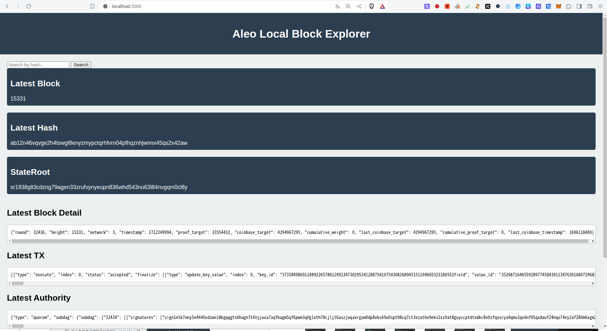

# aleo-local-explorer

## Image



## Dev

```
node : v18.20.0
npm  : 10.5.0
os   : Ubuntu 22.04.4 LTS
mysql: 8.0.36-0ubuntu0.22.04.1

```

## Install

```
git clone https://github.com/hex-aragon/aleo-local-explorer
cd aleo-local-explorer
npm i
```

## Getting Started

devnet.sh : https://raw.githubusercontent.com/AleoHQ/snarkOS/testnet3/devnet.sh

```
# start devnet
./devnet.sh

# start mysql db
systemctl start mysql

# start nodemon
nodemon server.js
```

## Description

```
We need BlockExplore in our local development environment because it's too hard and time-consuming to manually request all the API data to the browser to see it, so to compensate for that shortcoming, I made the local devnet data viewable with Explore.

```

## Using Aleo API

```
http://localhost:3030/testnet3/latest/block
http://localhost:3030/testnet3/peers/all

```
